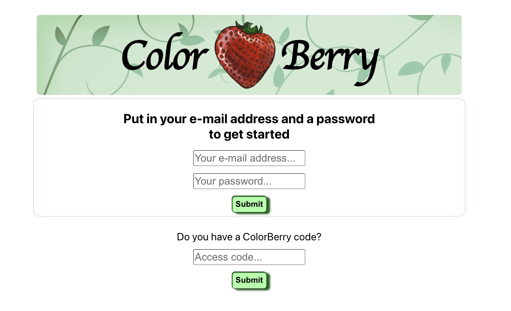
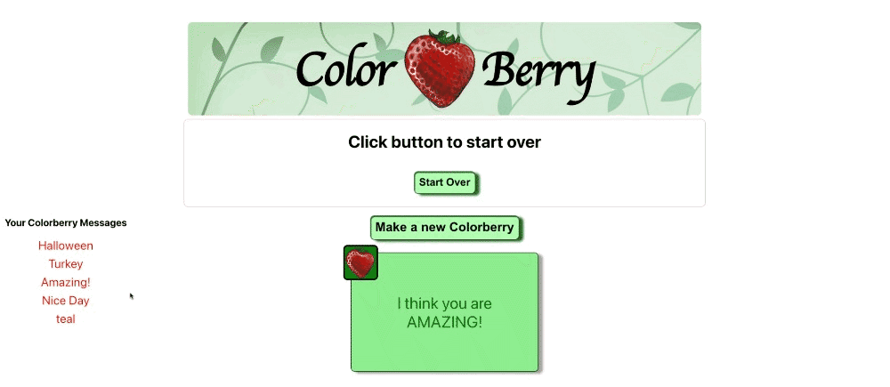
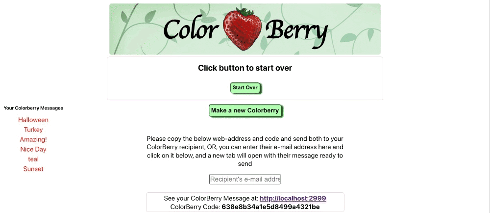
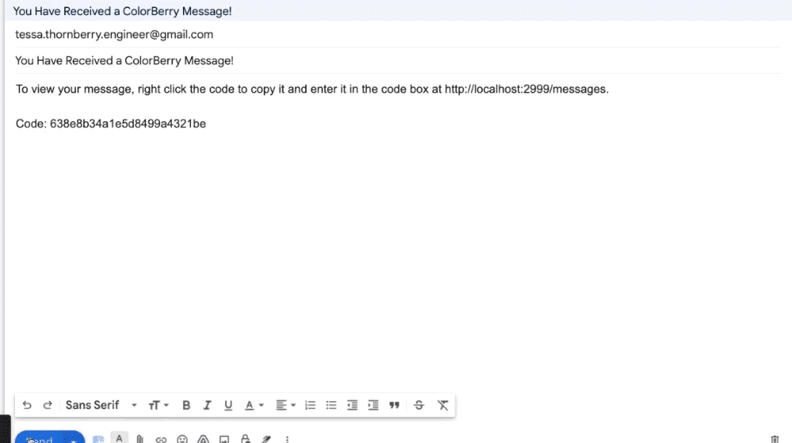
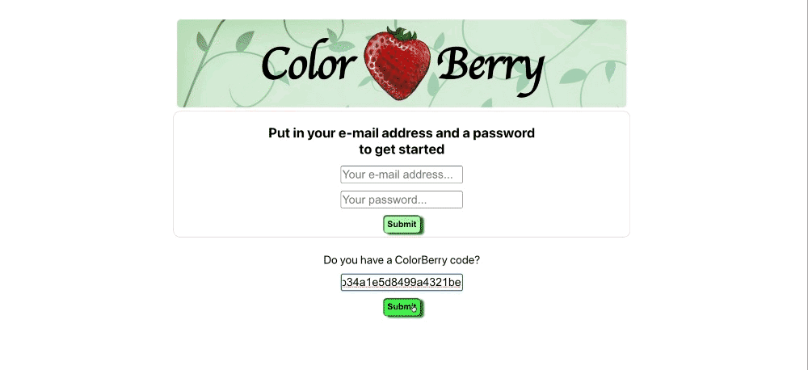

<a name="readme-top"></a>
# ColorBerry Messages

A simple messaging app where you can color in the messages
<p align="left">
  
</p>


  <p align="left">
    <br />
    <a href="https://github.com/tessathornberry/Colorberry-messages"><strong>Explore the docs »</strong></a>
    <br />
    <br />
    <a href="https://github.com/tessathornberry/Colorberry-Messages/issues">Report Bug</a>
    ·
    <a href="https://github.com/tessathornberry/Colorberry-Messages/issues">Request Feature</a>
  </p>
</div>


<!-- TABLE OF CONTENTS -->
<details>
  <summary>Table of Contents</summary>
  <ol>
    <li>
      <a href="#about-the-project">About The Project</a>
      <ul>
        <li><a href="#built-with">Built With</a></li>
      </ul>
    </li>
    <li>
      <a href="#getting-started">Getting Started</a>
      <ul>
        <li><a href="#prerequisites">Prerequisites</a></li>
        <li><a href="#installation">Installation</a></li>
      </ul>
    </li>
    <li><a href="#usage">Usage</a></li>
    <li><a href="#contact">Contact</a></li>
    <li><a href="#acknowledgments">Acknowledgments</a></li>
  </ol>
</details>


<!-- ABOUT THE PROJECT -->
## About The Project
This was a simple 3-day web app coloring-message project; a starting point for future development. 

<p align="center">
  
</p>

In this app, one can log in, create a short message, color two boxes and the text with the palette, and save the colored-in message to the database, afterwhich, it will appear on the user's list. 

<p align="center">
  
</p>

At the time a message is created, a form allows the user two options:
1. to either copy and paste a unique code to send to a recipient in the messaging app of their choice, or 
2. fill the recipient's e-mail in to make it into a mailto hotlink, that, when clicked, opens the user's default e-mail service in a new tab.
<p align="center">
  
</p>
If the user elects the second option, they are provided an e-mail prefilled with the recipient's address and the site link and code. 
<p align="center">
  
</p>
When a user copies the code and visits the site, regardless of if they are a user or not, the code will provide them with the sender's colored-in message.
<p align="center">
  
</p>

<p align="right">(<a href="#readme-top">back to top</a>)</p>


### Built With

* [![React][React.js]][React-url]
* [![Express][Express.js]][Express-url]
* [![Node][Node.js]][Node-url]
* [![MongoDB][MongoDB]][MongoDB-url]

<p align="right">(<a href="#readme-top">back to top</a>)</p>


<!-- GETTING STARTED -->
## Getting Started

To get a local copy of this simple web app, follow the steps below:

### Prerequisites

* npm
  ```sh
  npm install npm@latest -g
  ```
* <a href="https://www.mongodb.com/docs/manual/installation/">MongoDB installed</a> and running (Community version ok)

### Installation

1. Clone the repo
   ```git
   git clone https://github.com/tessathornberry/Colorberry-Messages.git
   ```
2. Navigate into the root directory and the server directory and install npm packages

   ```git
   npm install
   -----------
   cd server/
   npm install
   ```
   
3. In new terminal window, navigate into the server directory and enter:

   ```sh
   npm run server-dev
   ```
   
4. In new terminal window, navigate into the root directory and enter:

   ```sh
   npm run start
   ```
   
<p align="right">(<a href="#readme-top">back to top</a>)</p>


<!-- USAGE EXAMPLES -->
## Usage

This app is a starting point for creating your own message-coloring app. You might use svg files rather than divs, and you might use React Color for a swatch palette instead of a static palette. Firebase might also be added for secure and unique log-in capabilities.


<p align="right">(<a href="#readme-top">back to top</a>)</p>


See the [open issues](https://github.com/github_username/repo_name/issues) for a full list of proposed features (and known issues).

<p align="right">(<a href="#readme-top">back to top</a>)</p>


<!-- CONTACT -->
## Contact
- 📫 How to reach me **<a target="_blank" mailto="tessa.thornberry.engineer@gmail.com">tessa.thornberry.engineer@gmail.com</a>**
<p align="left">
<a href="https://linkedin.com/in/tessathornberry" target="_blank"></a>
</p>

Project Link: [https://github.com/tessathornberry/Colorberry-messages](https://github.com/tessathornberry/Colorberry-messages)

<p align="right">(<a href="#readme-top">back to top</a>)</p>

<!-- PROJECT LOGO -->
<br />
<div align="center">
  <a href="https://github.com/SpiritedAway-BO/Capstagram">
    
  </a>
  
<!-- ACKNOWLEDGMENTS -->
## Acknowledgments

* Green vines background/banner <a href="https://www.freepik.com/free-vector/seamless-intertwined-branches-leaves-pattern_10601246.htm#query=website%20background%20green%20leaves&position=3&from_view=search&track=sph">Image by macrovector</a> on Freepik
* Berry painting by <a href="http://www.tessathornberry.com">Tessa Thornberry</a>

<p align="right">(<a href="#readme-top">back to top</a>)</p>

<!-- MARKDOWN LINKS & IMAGES -->
<!-- https://www.markdownguide.org/basic-syntax/#reference-style-links -->
[contributors-shield]: https://img.shields.io/github/contributors/tessathornberry/Colorberry-Messages.svg?style=for-the-badge
[contributors-url]: https://github.com/github_username/repo_name/graphs/contributors
[forks-shield]: https://img.shields.io/github/forks/github_username/repo_name.svg?style=for-the-badge
[forks-url]: https://github.com/github_username/repo_name/network/members
[stars-shield]: https://img.shields.io/github/stars/github_username/repo_name.svg?style=for-the-badge
[stars-url]: https://github.com/github_username/repo_name/stargazers
[issues-shield]: https://img.shields.io/github/issues/github_username/repo_name.svg?style=for-the-badge
[issues-url]: https://github.com/github_username/repo_name/issues
[license-shield]: https://img.shields.io/github/license/github_username/repo_name.svg?style=for-the-badge
[license-url]: https://github.com/github_username/repo_name/blob/master/LICENSE.txt
[linkedin-shield]: https://img.shields.io/badge/-LinkedIn-black.svg?style=for-the-badge&logo=linkedin&colorB=555
[linkedin-url]: https://linkedin.com/in/linkedin_username
[product-screenshot]: images/screenshot.png
[React.js]: https://img.shields.io/badge/React-20232A?style=for-the-badge&logo=react&logoColor=61DAFB
[React-url]: https://reactjs.org/
[Express.js]: https://img.shields.io/badge/express.js-485063?style=for-the-badge&logo=express&logoColor=61DAFB
[Express-url]: https://expressjs.com/
[MongoDB]: https://img.shields.io/badge/mongodb-47A248?style=for-the-badge&logo=mongodb&logoColor=white
[MongoDB-url]: https://mongodb.com
[Node.js]: https://img.shields.io/badge/node.js-6DA55F?style=for-the-badge&logo=node.js&logoColor=white
[Node-url]: https://nodejs.org/
